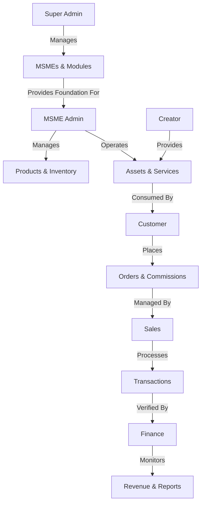

# CreatiSphere System Process Flow

CreatiSphere is a multi-tenant ERP and Marketplace platform designed for MSMEs (Micro, Small, and Medium Enterprises) and Creators. The system is structured into specialized portals that interact to form a cohesive ecosystem.

## 1. System Ecosystem Overview

The following diagram illustrates the high-level interaction between the different user roles and the central system.

---

## 2. Core Workflows

### A. MSME Onboarding & Governance (Super Admin)
This flow ensures the platform's growth and stability.
1.  **Registration**: Super Admin registers a new MSME in the system.
2.  **Tier Assignment**: Assigns an ERP Tier (Starter, Standard, Enterprise Plus).
3.  **Module Provisioning**: Enables specific modules based on the MSME's needs.
4.  **System Monitoring**: Tracks system health and MSME activity to ensure uptime.

### B. Product & Asset Lifecycle (Admin & Creator)
The bridge between creation and commerce.
1.  **Asset Creation**: Creators upload digital assets to the **Asset Library**.
2.  **Inventory Management**: Admins manage physical and digital stock via **Manage Inventory**.
3.  **Product Cataloging**: Assets and items are curated into the **Product Marketplace**.
4.  **Marketplace Publishing**: Items become visible to customers in the **Browse Marketplace** view.

### C. The Order & Commission Engine (Customer -> Sales)
The primary revenue-generating process.
1.  **Discovery**: Customer browses products or looks for creators for custom work.
2.  **Order Placement**:
    *   **Standard Order**: Direct purchase from the catalog.
    *   **Custom Commission**: Request for bespoke work (managed via **Commissions**).
3.  **Transaction Processing**: Sales Staff handle payments and verify transaction details.
4.  **Fulfillment & Tracking**:
    *   Admin/Creator updates progress.
    *   Customer tracks status via **Track Orders**.
5.  **Completion**: Delivery of asset/product and customer feedback.

### D. Revenue & Performance Analysis (Sales -> Finance)
Closing the loop with data-driven insights.
1.  **Sales Logging**: Every successful order is recorded as a **Sales Transaction**.
2.  **CRM Management**: Sales staff manage customer relationships and leads.
3.  **Revenue Monitoring**: Finance tracks incoming cash flow and creator payouts.
4.  **Reporting**: Automated generation of **Business Reports** for strategic decision-making.

---

## 3. Role-Based Navigation Map

| Role | Primary Dashboard | Key Responsibilities |
| :--- | :--- | :--- |
| **Super Admin** | System Dashboard | MSME Onboarding, Module Management, System Audits |
| **MSME Admin** | Admin Dashboard | Inventory, Product Management, Staff Oversight |
| **Customer** | Customer Portal | Marketplace Browsing, Order Tracking, Feedback |
| **Creator** | Creator Studio | Asset Management, Commission Fulfillment |
| **Sales** | Sales Desk | Transaction Processing, CRM, Performance Tracking |
| **Finance** | Finance Hub | Revenue Auditing, Financial Reporting |

---

## 4. Technical Data Flow

The system uses a centralized `DatabaseService` to ensure data integrity across all portals.

1.  **UserSession**: Maintains the logged-in user's role and MSME context.
2.  **SQL Backend**: Stores relational data for Accounts, MSMEs, Products, and Transactions.
3.  **Schema Sync**: The system automatically ensures database tables (Inventory, Products, etc.) are up-to-date upon service initialization.
